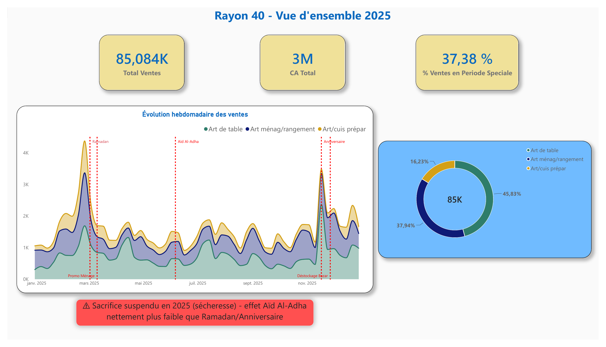
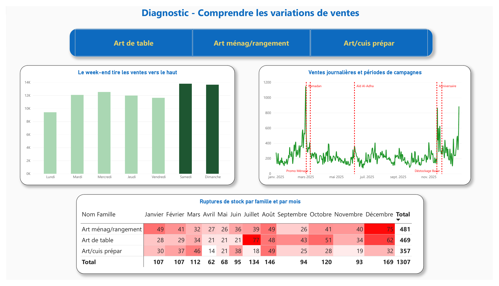
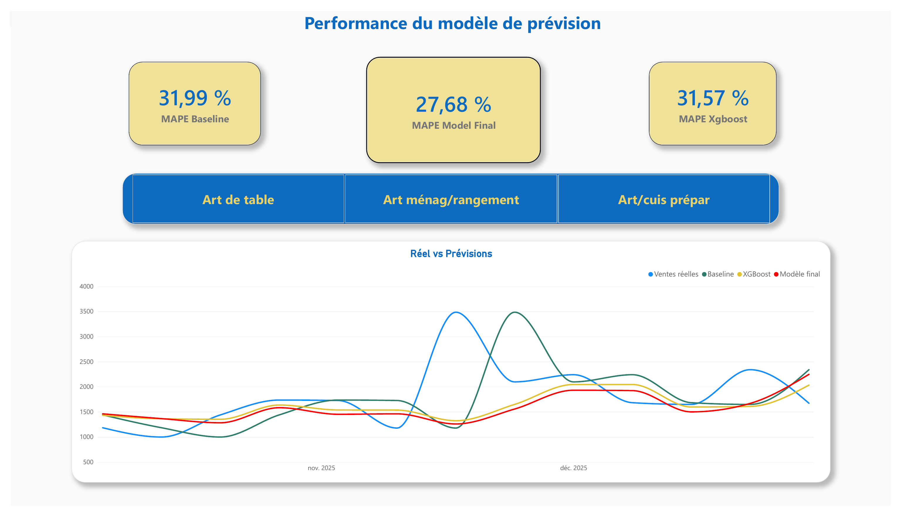
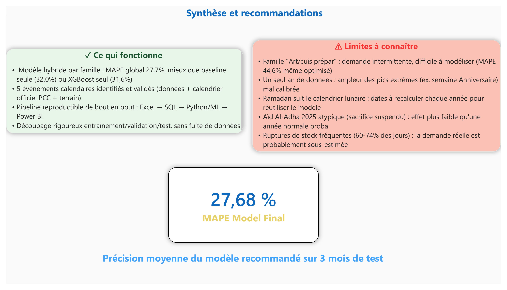

# Marjane Demand Forecasting

End-to-end demand forecasting pipeline built during a Data Analyst internship at **Marjane Taza** (retail/hypermarket chain, Morocco) - from raw daily sales files to a business-facing Power BI dashboard.

## Business context

Marjane Taza wanted to explore demand forecasting for a household-goods category (Ménage - 3 sub-categories: kitchenware, tableware, and storage/organization, ~2,860 SKUs), using one year of daily sales data (2025) and a 10-day delivery window.

## What this project does

1. **Consolidation** (Python/pandas) - reads and merges 12 monthly Excel files (37,227 daily records) into a clean, dated dataset filtered on the target category
2. **SQL exploration** (SQLite) - diagnoses weekly/daily seasonality, stock-out patterns, and cross-validates 5 recurring demand spikes against Marjane's official promotional calendar (PCC) and field input from the department manager
3. **Feature engineering** (pandas) - weekly aggregation, campaign-window flags, lag features, and leakage-free rolling averages
4. **Modeling** (XGBoost + naive baseline) - a rigorous train/validation/test split (no test-set peeking during hyperparameter search), evaluated with MAPE
5. **Power BI dashboard** - a 4-page report translating the analysis for non-technical stakeholders (sales overview, diagnostics, model performance, recommendations & limitations)

## Dashboard preview

**Page 1 - Overview**


**Page 2 - Diagnostics & seasonality**


**Page 3 - Forecast performance**


**Page 4 - Recommendations & limitations**


## Key results

| Category | Baseline MAPE | XGBoost MAPE | Selected model |
|---|---|---|---|
| Art de table | 34.4% | **28.3%** | XGBoost |
| Art ménager/rangement | 28.7% | **21.8%** | XGBoost |
| Art/cuisine prépar. | **32.9%** | 44.6% | Baseline (intermittent demand) |
| **Overall (hybrid)** | 32.0% | — | **27.7%** |

No single model won everywhere - the final model is a **per-category hybrid**: XGBoost where it reliably beats the baseline, and the simple baseline where a more complex model overfits on too little data (intermittent-demand category). This choice, along with every other modeling decision, is documented with its rationale (see `decision_log.md`).

## Tech stack

`Python` (pandas, XGBoost, scikit-learn-style validation) · `SQL` (SQLite) · `Power BI` (DAX, Power Query) · `Excel`

### Repository structure

```
README.md
decision_log.md
.gitignore
src/
  consolidation.py         # Excel -> clean SQLite table
  exploration.py            # SQL diagnostics: seasonality, campaigns, stock-outs
  feature_engineering.py    # Weekly aggregation, lags, rolling averages, campaign flags
  modelisation.py           # Baseline, XGBoost grid search, hybrid model, MAPE evaluation
dashboard/
  dashboard prevision de la demande.pbix   # 4-page Power BI report
screenshots/                 # PNG export of each dashboard page
```

Raw sales files, the SQLite database, and exported CSVs are excluded from version control (`.gitignore`) - they're either confidential retail data or fully regenerable by re-running the scripts in order.

## Honest limitations

- Single year of data (2025): the model has never seen a second occurrence of any yearly event, so peak *magnitude* is likely under-calibrated
- Ramadan follows the lunar calendar and shifts ~10-11 days earlier each year - the campaign-window feature needs manual updates for future years
- One category shows intermittent demand, a pattern XGBoost struggles with regardless of tuning; a dedicated method (e.g., Croston) would likely help more than additional generic data
- Frequent stock-outs (60–74% of days affected across categories) mean observed sales likely under-represent true demand on some days

## Author

Yassir Bouchnaf - Business & Data Management student, ESITH Casablanca
[LinkedIn](https://www.linkedin.com/in/yassir-bouchnaf-695137350/) · [yassirbouchnaf279@gmail.com](mailto:yassirbouchnaf279@gmail.com)
